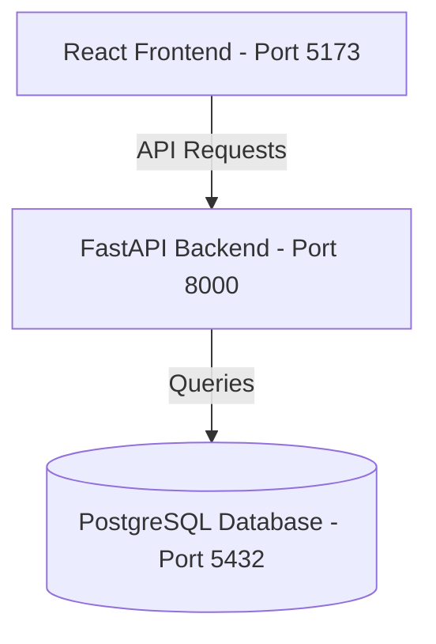

# Inventory & Order Management System

A production-ready, containerized full-stack application for managing products, customers, orders, and stock inventory. Featuring a Python FastAPI backend, React (Vite) frontend, and PostgreSQL database.

---

## 🎨 Design System & Visual Aesthetics

The frontend is styled using custom HSL properties, vanilla CSS transitions, and glassmorphism cards to create a premium, sleek dark-themed workspace. 

- **Electric Teal & Indigo Accents**: Custom HSL glows represent interactive states and success indicators.
- **Glassmorphic Panels**: Custom blur backdrops and subtle borders wrap statistical dashboards and tables.
- **Micro-Animations**: Clean scaling on button states, fade-in modals, and pulsing indicator lights for low-stock alerts.
- **Responsive Layout**: Designed for seamless transitions between mobile viewports and large desktop resolutions.

---

## 🏗️ Architecture & Component Structure



### 1. Database Schema
- **`products`**: Tracks individual items with unique `sku` codes, catalog unit pricing, and stock quantity balances.
- **`customers`**: Holds buyer profiles with unique, formatted `email` addresses.
- **`orders`**: Records transaction totals, times, and links back to the customer profile.
- **`order_items`**: Junction table mapping orders to products, locking in the unit price at checkout to preserve invoice integrity.

### 2. Business Rules & Validations
- **SKU Uniqueness**: Blocks creation/modification of products using matching SKU values.
- **Email Uniqueness**: Blocks registry of customers with matching email addresses.
- **Inventory Safety**: Validates product counts before ordering. Prevents checking out quantities that exceed available stock.
- **Atomic Stock Deduction**: Reduces `quantity_in_stock` inside database transactions. Rollbacks transaction on error.
- **Stock Restoration**: Automatically adds items back to product inventory when an order is cancelled or deleted.
- **Cascade Deletions**: Deleting a customer automatically cancels their active invoices and restores the stock.

---

## 🚀 Setup & Running Locally

### Prerequisites
- [Docker](https://www.docker.com/) and [Docker Compose](https://docs.docker.com/compose/)
- Alternatively, Python 3.11+ and Node 20+ for local installation.

### Option A: Running with Docker Compose (Recommended)
1. Clone the repository and navigate to the project directory.
2. Build and spin up all three containers (Database, Backend, Frontend):
   ```bash
   docker-compose up --build
   ```
3. Open your browser and navigate to:
   - **Frontend UI**: [http://localhost:5173](http://localhost:5173)
   - **Interactive Swagger Docs**: [http://localhost:8000/docs](http://localhost:8000/docs)

---

### Option B: Running Manually (Without Docker)

#### 1. Setup the Database
Ensure PostgreSQL is running locally and update the database connection URL inside a `.env` file at the root:
```env
DATABASE_URL=postgresql://<user>:<password>@localhost:5432/inventory_db
CORS_ORIGINS=http://localhost:5173
```

#### 2. Run the FastAPI Backend
```bash
# Navigate to backend directory
cd backend

# Create & activate virtual environment
python -m venv venv
venv\Scripts\activate # On Linux/macOS: source venv/bin/activate

# Install requirements
pip install -r requirements.txt

# Start local server
uvicorn app.main:app --reload
```

#### 3. Run the React Frontend
```bash
# Navigate to frontend directory
cd frontend

# Install package modules
npm install

# Start Vite hot-reload server
npm run dev
```
Open [http://localhost:5173](http://localhost:5173) in your browser.

---

## 🧪 Testing

We have built an integration test suite validating constraints, unique keys, and transaction-safe stock deductions.

To execute tests on your local python virtual environment:
```bash
cd backend
venv\Scripts\activate
python -m pytest tests/test_api.py -v
```

---

## ☁️ Deployment Instructions

The application is fully pre-configured for containerized cloud deployment.

### Backend (Render/Railway)
1. **Render Web Service**: Create a new Web Service and link your GitHub repository.
2. Select **Docker** as the environment runtime.
3. Configure the following environment variables:
   - `DATABASE_URL`: Connection string pointing to your remote PostgreSQL instance.
   - `CORS_ORIGINS`: Your live frontend deployment URL (e.g. `https://your-frontend.vercel.app`).

### Frontend (Vercel/Netlify)
1. Import the `frontend` subdirectory of your repository.
2. Select **Vite** or **Create React App** as the build configuration preset.
3. Set the Environment Variable:
   - `VITE_API_URL`: Set to your live backend API URL (e.g. `https://your-backend.onrender.com`).
4. Build settings: Build Command: `npm run build`, Output Directory: `dist`.
